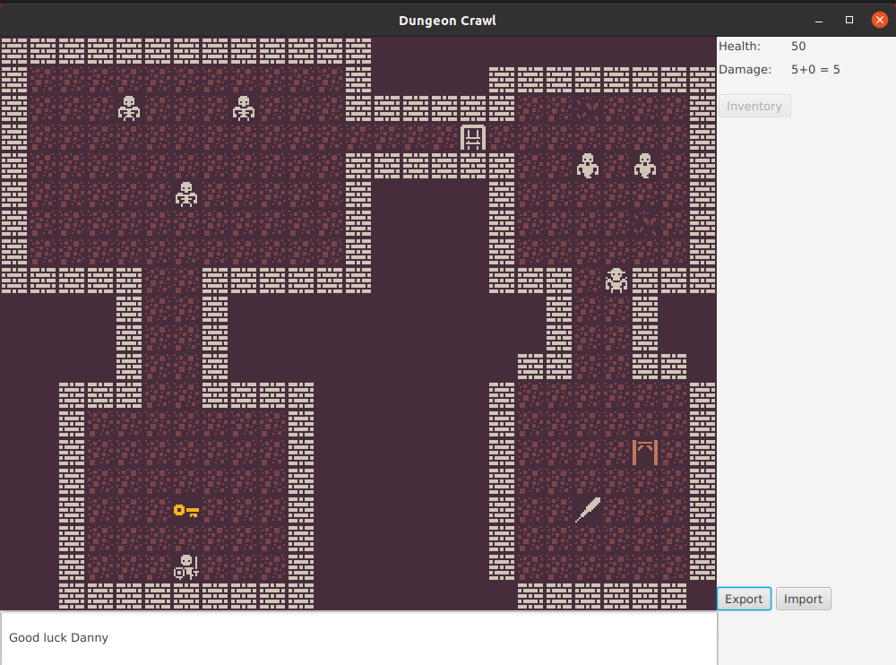

# Dungeon Crawl

## Story

Dungeon Crawl is a Roguelike game written in java. The game is formed of two levels with different textures.
You can name your hero and also receive an endgame message depending on whether you win or lose.

## Features
-> Hero can interact with monsters

-> Power can be enhanced picking up the sword item

-> Level 2 can only be accessed only after gaining the key item and unlocking the gate

-> User can save the current state of the game in a save file. 

## Technologies used
- JavaFx for the graphical user interface
- JSON for saving the map state
- Images used from the 1Bit pack by Kenney (link: https://kenney.nl/assets/bit-pack)

